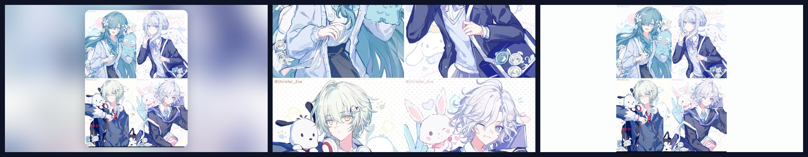

# 💙 原神 CP 壁纸套件 17 · 奥黛塔 × 沃雅妮莎 × 米提亚 × 阿罗夏

**单张素材 × 三种摆法 = 3 种壁纸**一键切换 / 可视化切换器 / 桌面桌宠 /
多 IDE 皮肤 / DeepKing 界面皮肤。素材内置于发行包, **离线可用**;
跨平台 Windows / macOS / Linux。



## ✨ 素材

**「四人合影」** —— 2×2 四宫格校服合影:

| 位置 | 角色 |
|---|---|
| 左上 | 奥黛塔(青绿发, 抱蓝色吉祥物) |
| 右上 | 沃雅妮莎(银发, 校服领结) |
| 左下 | 米提亚(银白发, 背双肩包) |
| 右下 | 阿罗夏(银卷发, 眨眼比耶) |

四人皆深蓝校服, 背景是浅色底配淡樱粉与吉祥物纹样。

> 原图左上角有两处画师署名(`@Christar_Eve`), 按用户决定**保留原样**。

## ⭐ 默认是「完整」而不是「卡片式」

素材是 1104×1480 的**竖图**(ar 0.746), 而屏幕通常是 16:9(1.778)。
竖图铺满 16:9 必须**上下裁掉大半** —— 满屏取景窗只占源高的 **42%**,
会正好从四宫格中间横切过去, 四位角色都只剩一部分(看不到任何一张完整的脸)。

所以本套件把默认模式设为 **`showall1`(完整)**: 整张图完整显示, 左右留同色边,
四格都看得见。想要满屏效果仍可显式用 `genshen-cp17 cover`。

| 模式 id | 名称 | 效果 | 适合 |
|---|---|---|---|
| `showall1` | **完整**(默认) | 等比放进同色底, **一个像素都不裁** | 竖图 / 四宫格首选 |
| `single1` | 卡片式 | 模糊填充背景 + 居中圆角卡片, 构图完整不裁切 | 想要卡片边框 |
| `cover1` | 满屏 | cover 铺满整屏, 无边框 | 想要沉浸感(但竖图会裁掉大半) |

## 🚀 给 AI 一句话安装

把本仓库链接发给**任意 AI**(DeepKing、Claude Code、Kimi Code、CodeX、Trae、Cursor、
JetBrains AI、DSH Harness 等), 它会读 [`AGENTS.md`](AGENTS.md) 替你装完:

```text
请安装 https://github.com/WPH666-py/Genshen-skin-CP17 的原神CP17壁纸
```

## 🖥️ 手动安装

要求: Python 3.9+。Pillow 缺失时脚本会自动 `pip install`。

```bash
# 方式一: 用仓库里已打包好的 wheel(离线可用)
pip install dist/genshen_skin_cp17-0.1.0-py3-none-any.whl
genshen-cp17-install         # 一键: 生成壁纸 + 设为桌面 + 注册已装 IDE

# 方式二: 源码
git clone https://github.com/WPH666-py/Genshen-skin-CP17.git
cd Genshen-skin-CP17
python -m genshen_skin_cp17.engine.autoinstall
```

Windows 用户也可以直接双击 `install.bat`。

## 🎨 常用命令

```bash
genshen-cp17               # 完整(默认, 四格全见)
genshen-cp17 showall       # 同上, 显式指定
genshen-cp17 single        # 卡片式
genshen-cp17 cover         # 满屏(竖图会上下裁掉大半)
genshen-cp17 card          # 等价 single
genshen-cp17 random        # 随机一种摆法
genshen-cp17 list          # 列出全部 3 种模式
genshen-cp17 switcher      # 可视化切换器(预览 + 一键应用)
genshen-cp17 pet           # 桌面桌宠(拖动 / 右键菜单 / Esc 退出)
genshen-cp17 cycle 30      # 每 30 分钟自动随机换
genshen-cp17 all --out DIR # 一次生成 3 张到指定目录
genshen-cp17 deepking      # 生成 DeepKing 界面皮肤 + 离线预览
genshen-cp17 info          # 环境与素材自检
```

常用选项: `--size 2560x1440` 指定分辨率(默认取屏幕分辨率)、`--no-set` 只生成不设置。

## 🧩 IDE / 桌宠支持

| 环境 | 接入方式 |
|---|---|
| **VSCode / Trae / CodeX / Cursor / Windsurf** | 活动栏「原神CP17」→ 皮肤画廊 3 张卡片一键换; 命令面板搜 `原神CP17` |
| **DeepKing** | 设置 → 界面皮肤 → 粘贴本仓库地址, 自动生成雾蓝配色皮肤 |
| **PyCharm / WebStorm / IntelliJ** | Settings → Appearance & Behavior → Appearance → **Background Image** |
| **Claude Code / Kimi Code / Harness 等** | 注册 MCP 服务器, AI 直接调 `set_wallpaper` / `next_wallpaper` |
| **桌面桌宠** | `genshen-cp17 pet` —— 透明置顶圆形立绘, 可拖动、右键菜单 |

一键注册全部已装 IDE:

```bash
genshen-cp17-install --only vscode jetbrains mcp deepking
```

## 📁 目录

```
src/genshen_skin_cp17/
  characters/cp17_quartet.py  角色与素材定义(换角色只改这一个文件)
  engine/                     皮肤引擎: 合成 / 壁纸设置 / CLI / 桌宠 / 切换器 /
                              MCP 服务器 / DeepKing 适配 / 自动安装
  deepking_skin.py            手工校色的 DeepKing 调色板(32 槽位)
src/client/                   DeepKing 配色变量 + 维护说明
vscode/                       VSCode/Trae/CodeX 扩展(含打包好的 .vsix)
ide/jetbrains/                JetBrains 背景图指引
tools/                        维护脚本(推送 / 引擎同步 / 线上契约校验)
AGENTS.md                     给 AI 的自动安装指引
```

## ❓ 常见问题

- **满屏模式为什么不好看**: 素材是竖图, 铺满 16:9 必须上下裁掉大半,
  建议用默认的「完整」。想换摆法: `genshen-cp17 single` / `genshen-cp17 cover`。
- **壁纸尺寸**: 默认取主屏分辨率; 多显示器建议加 `--size 2560x1440`。
- **命令找不到**: Scripts 目录不在 PATH, 改用 `python -m genshen_skin_cp17.engine.cli`。
- **桌宠不透明**: 个别 Linux 桌面不支持透明色键, 会退化为白底卡片, 功能不受影响。

## 🔗 与其它套件的关系

与 WPH666-py 的其它皮肤套件**完全独立**: 包名 `genshen-skin-cp17`、
命令前缀 `genshen-cp17`、运行时目录 `~/.genshen-cp17`、
vscode 扩展 ID `wp666.genshen-skin-cp17`、
DeepKing 皮肤 id `genshen-cp17-odette-voyanisa-mitiya-arosha`
互不冲突, 各套件可同时安装。引擎与其它套件共用同一套实现。

## 🙏 素材说明

1 张奥黛塔 × 沃雅妮莎 × 米提亚 × 阿罗夏同人插画(保留画师署名 `@Christar_Eve`)。
**仅用于个人桌面美化, 请勿二次商用。** 版权归原作者所有。

## 📄 许可

代码以 MIT 许可发布(见 [LICENSE](LICENSE)); 插画素材不在 MIT 授权范围内。
